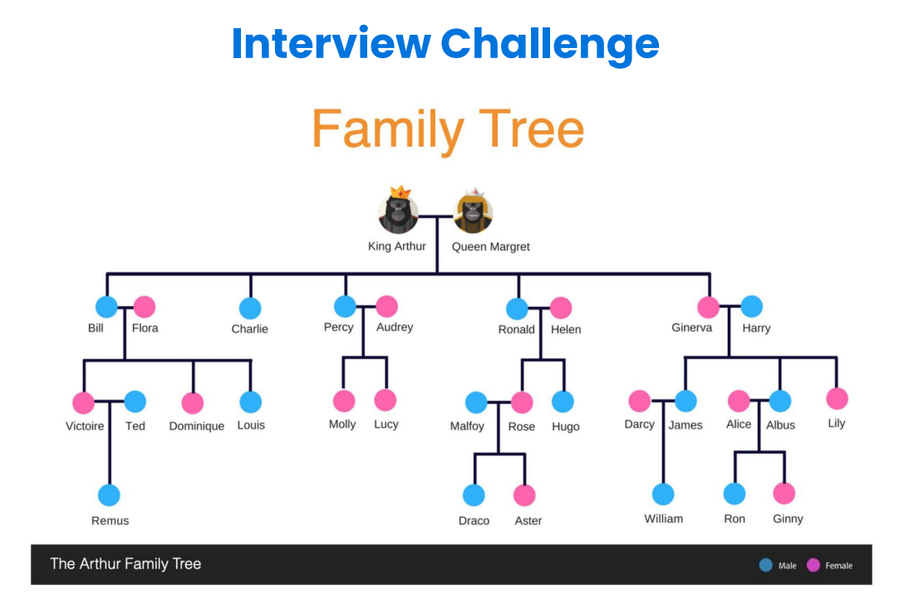
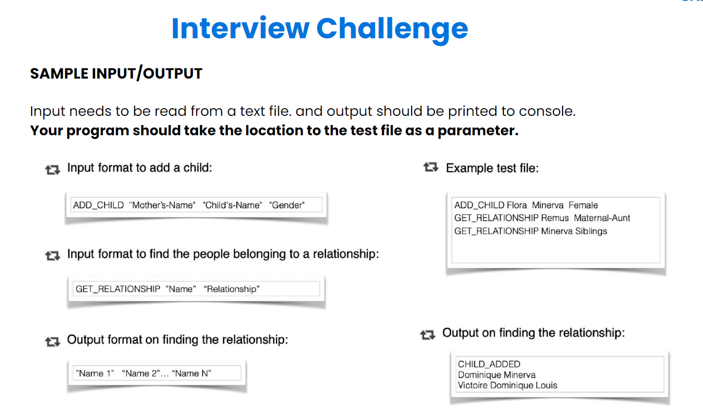
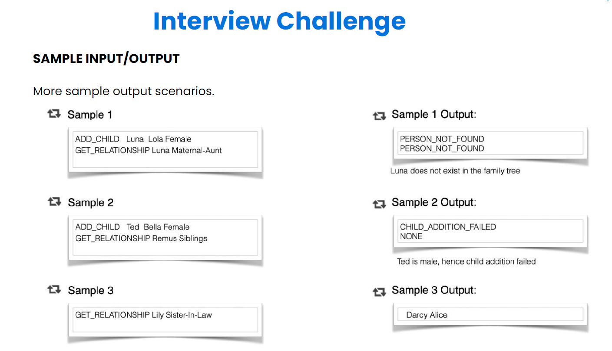
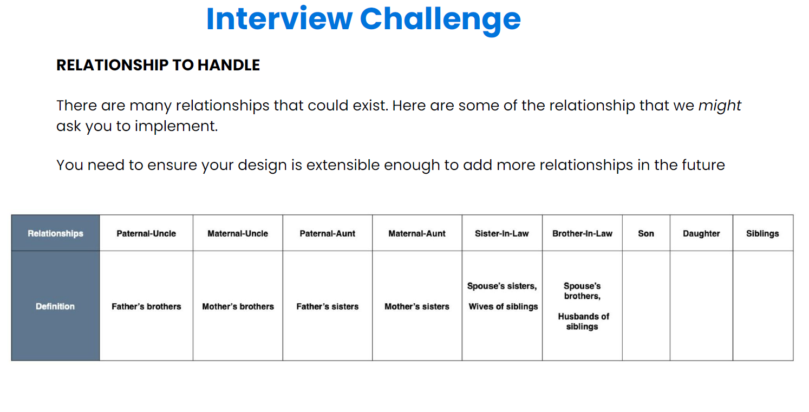
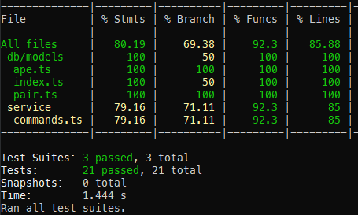

# Interview Challenge

This project was for a technical test for shippit.

It is done in Node.js / TypeScript / SequeliZe.

# Problem Description

Our problem is set on the planet of Lengaburu,
the distant galaxy of Tara B. Our protagonists
are King Arthur, Queen Margaret and their
family.
King Arthur is the emperor of Lengaburu and
has been ruling the planet for the last 350
years (they have long lives in Lengaburu!). Let’s
write some code to get to know the family.
The coding problem is for backend and full
stack engineers. It tests the object oriented
fundamentals.



# Solution Requirements

The solution should model out the King Arthur family tree so that:
- You should be able to add a child to any family in the tree through the mother
- Given a ‘name’ and a ‘relationship’, you should output the people corresponding to
the relationship in the order in which they are added to the family tree

Simple right? Remember, our evaluation is based not only on getting the right output, but
on how you come up with the solution altogether.








# starting db server

```bash
docker compose up -d
```

# start app in dev mode using nodemon and ts-node

```bash
npm run start:dev
```

# builds the app for production

```bash
npm run build
```

# starts the app after building

```bash
npm run start
```

# run migrations

```bash
npx sequelize db:migrate
```

# undo migrations

```bash
npx sequelize db:migrate:undo
```

# run seeders

```bash
npx sequelize db:seed:all
```

# undo seeders

```bash
npx sequelize db:seed:undo
```

# run tests

```bash
npm test
```


